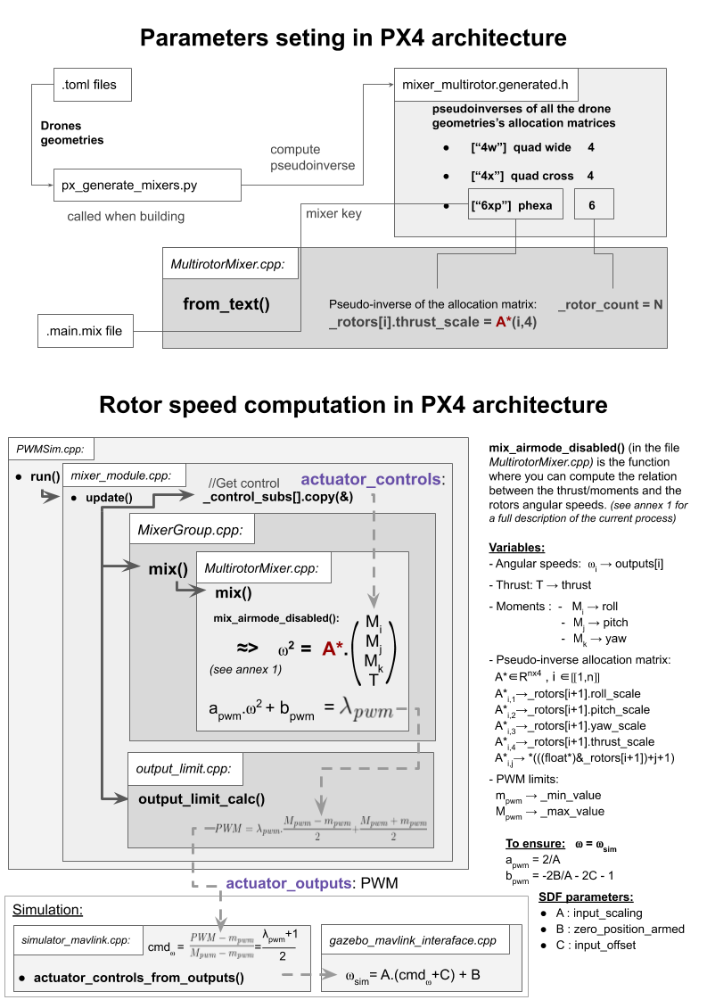

# Install
## Ubuntu
```bash
cd ~/Download
wget https://raw.githubusercontent.com/PX4/Devguide/v1.9.0/build_scripts/ubuntu_sim_ros_melodic.sh
sudo chmod +x ubuntu_sim_ros_melodic.sh
./ubuntu_sim_ros_melodic.sh
```

### clone custom Multirotor Mixer
```bash
cd ~/src/Firmware/src/lib/mixer/
rm MultirotorMixer/* -rf
git clone git@github.com:Aightech/MultirotorMixer.git
```


# New config
## Esay Multicopter
```bash
cd ~/src/Firmware/src/lib/mixer/MultirotorMixer/geometries/tools
```
Open the file called mc_param.erb and customize the multicopter parameters.
Then launch the generate_model script with the name of your model and a free ID
```bash
./generate_model phexa 10040 
```
Now you can run the gazebo simulation:
```bash
cd ~/src/Firmware/
make px4_sitl gazebo_phexa
```

## Files
- [ ] [*Model*](#Model) (Tools/sitl_gazebo/models/ .config & .sdf)
- [ ] [*Init*](#Init) (ROMFS/px4fmu_common/init.d-posix/ )
    - [ ] *Init.d* (ROMFS/px4fmu_common/init.d/rc.mc_default)
    - [ ] [*Mixer*](#Mixer) (ROMFS/px4fmu_common/mixers/)
        - [ ] [*Geometry*](#Geometry) (/src/lib/mixer/MultirotorMixer/geometries/)

## Model
In Tools/sitl_gazebo/models/ create directory with the name of your model (ex:phexa) and add in this directory: 
- Config file for the metadata of the model (ex: model.config)
### Example
```xml
<?xml version="1.0"?>
<model>
  <name>perso Hexa</name>
  <version>1.0</version>
  <sdf version='1.4'>phexa.sdf</sdf>

  <author>
   <name>Devillard</name>
  </author>

  <description>
    This is a model of my personal hexarotor.
  </description>
</model>
```
- SDF file describing the 3D model (ex: phexa.sdf). *Note:* You can use the [ERB file](#ERB) to generate a parametrized multirotor easily.

In platforms/posix/cmake/sitl_target.cmake add your model to the list starting with set(models ... 

## Init
In ROMFS/px4fmu_common/init.d-posix/ create a file with the name of your model suffixed with an unused ID (ex: 10040_phexa):
- [ ] Specify the init.d file (ex: sh /etc/init.d/rc.mc_defaults )
- [ ] Specify the MAV_TYPE of the model (ex: set MAV_TYPE 13) 2:quad 13:hexa (impact the way output/pwm are processed)
- [ ] Specify the mixer (ROMFS/px4fmu_common/mixer/*.main.mix files) it will use (ex: set MIXER phexa)

### Example
```bash
#!/bin/sh
#
# @name personalized hexa SITL
#
# @type hexa xp
#

sh /etc/init.d/rc.mc_defaults
set MAV_TYPE 13
set MIXER phexa
```

## Mixer
In ROMFS/px4fmu_common/mixers/ create a file with the name of your mixer and the extension .main.mix (ex: phexa.main.mix):
- [ ] Specify the geometry (/src/lib/mixer/MultirotorMixer/geometries/.toml) it will use (ex 6xp).
- [ ] For now the other param are unused.

### Example 
```
# Hexa XP

R: 6xp 10000 10000 10000 0
```
## Geometry
In /src/lib/mixer/MultirotorMixer/geometries/ create a file with the name of your geometry and the extension .toml (ex: phexa.toml):
- [ ] Specify the key of your geometry (the one specified in the mixer file) (ex: key = "6xp")
- [ ] Specify the geometry of your different rotors.

In /src/lib/mixer/MultirotorMixer/CMakeLists.txt add your geometry to the list starting with `set(geometry_files ...`
### Example
```toml
# Generic multicopter configuration

[info]
key = "6xp"
description = "multicopter"

[rotor_default]
axis      = [0.0, 0.0, -1.0]
Ct        = 8.54858e-06
Cm        = 0.05

[[rotors]]
name      = "rotor_0"
position  = [0.22, 0.12, 0.0]
direction = "CW"

[[rotors]]
name      = "rotor_1"
position  = [0.0, 0.25, 0.0]
direction = "CCW"

[[rotors]]
name      = "rotor_2"
position  = [-0.22, 0.13, 0.0]
direction = "CW"

[[rotors]]
name      = "rotor_3"
position  = [-0.22, -0.12, 0.0]
direction = "CCW"

[[rotors]]
name      = "rotor_4"
position  = [0.0, -0.25, 0.0]
direction = "CW"

[[rotors]]
name      = "rotor_5"
position  = [0.22, -0.13, 0.0]
direction = "CCW"
```

## Launching Gazebo
```bash
cd ~/src/Firmware/
make px4_sitl gazebo_phexa
```

# ERB
In the folder geometries/tools directory there are different files you can use to generate .toml and .sdf model for parametred multirotors

```bash
cd ~/src/Firmware/src/lib/mixer/MultirotorMixer/geometries/tools
```
## Parameters File
In the file mc_param.erb you can set the parmeters of your multcopter.

## Create .sdf files
```bash
(cat mc_param.erb && cat functions.erb && cat mc.sdf.erb) | erb -T 1 > ~/src/Firmware/Tools/sitl_gazebo/models/phexa/phexa.sdf
```

## Create .toml files
```bash
(cat mc_param.erb && cat functions.erb && cat mc.toml.erb) | erb -T 1 > ~/src/Firmware/src/lib/mixer/MultirotorMixer/geometries/phexa.toml
```

# Rotor speed computation explanation



